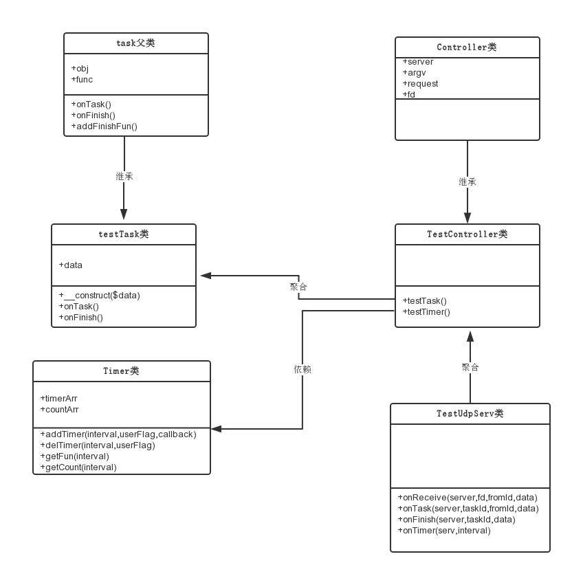

[TOC]
### 在framework下封装swoole的task和timer特性


#### 何为task ####

> task模块,是用来做一些异步的慢速任务，比如webim中发广播，发送邮件，写日志等。

**task的特点**

-   task进程必须是同步阻塞的
-   task进程支持定时器

#### 何为timer ####

> swoole_timer是基于timerfd+epoll实现的异步毫秒定时器，可完美的运行在EventLoop中，与swoole_client/swoole_event等模块可以无缝结合。

**timer的特点**

- woole_timer可以到毫秒级别
- 可同时设定多个定时器程序
- timer定时器对性能的损耗较低
- 支持异步回调

**总结**

- task可以执行在主逻辑下开一个旁路，完成一些不紧急也不会阻塞主逻辑的任务，进而提升服务的性能。
- timer可以很好的应对一些定时推送或者超时判断的需求和逻辑。在业务开发中,有很大的应用场景。

####原始版本的操作方法(部分代码) ####

```php

class testUdpServ {

	public function onReceive($server, $fd, $fromId, $data){

		//test for task
		$serv->task($data);

		//test for timer
		$serv->addtimer(5000);//do sth after 5 seconds
	}

	//task方法
	public function onTask($serv, $taskId, $fromId, $data){

		//TODO do some task
		$serv->finish($data);
	}

	//task任务完成的回调函数
	public function onFinish($serv, $taskId, $data){

		//TODO do sth when task finish
	}

	//timer方法
	public function onTimer($serv, $interval){

		//TODO do sth by interval
		switch($interval)
		{
			case 5000 ：{
					//do some sth
					break;
				}
		}
	}

```


####业务开发和swoole这两个特性的矛盾点 ####

- 调用task和timer都必须在一个入口，onReceive或者onRequest里，耦合性很高
- 业务代码是写在controller层，无法得到调用server函数创建task和timer任务
- 回调函数是统一回到server代码层，不能区分是哪一个业务创建的task和timer

####解决思路 ####

- 下方server实例到controller层，抽象出controller的父类，封装创建task和timer的函数
- 抽象出task基类，提供task的任务执行，和收尾处理两个函数，方便子类继承
- 把timer定时器理解为特殊的task，其任务就是定时通知，业务代码都在收尾处理的函数中实现
- server层代码，通过传递task实例来完成函数调用。保证了多个task也能正确调度，针对timer定时器，又做了一些特殊处理，因为timer定时器存在同一时间注册多个通知事件。


####设计类图####




####具体代码####
**task父类**

```php
<?php
/**
 * @Author: winterswang
 * @Date:   2015-02-28 10:58:35
 * @Last Modified by:   winterswang
 * @Last Modified time: 2015-03-03 16:12:50
 */

class Task {

	public $obj;
	public $func;

	/**
	 * [onTask task任务执行程序]
	 */
	public function onTask(){

	}

	/**
	 * [addFinishFun 自定义finish函数]
	 * @param array $data [description]
	 */
	public function addFinishFun($obj, $func){
		if (is_object($obj)) {
			if (method_exists($obj, $func)) {
				$this ->obj = $obj;
				$this ->func = $func;
			}else{
				return array('r' => 1,'error' => 'function not find');
			}
		}
		else{
			return array('r' => 1,'error' => 'the param is not an Object');
		}
		return array('r' => 0);
	}
}
?>
```

**task子类**

``` php

<?php
/**
 * @Author: winterswang
 * @Date:   2015-02-28 15:29:13
 * @Last Modified by:   winterswang
 * @Last Modified time: 2015-03-03 15:55:42
 */
class TestTask extends Task {

	public $data;
	public function __construct($data){
		$this ->data = $data;
	}

	/**
	 * [onTask description]
	 * @return [type] [description]
	 */
	public function onTask(){
		if (is_array($this ->data)) {
			array_push($this ->data,__METHOD__);
		}
		error_log(__METHOD__.print_r($this ->data,true),3,'/tmp/winters.log');
	}

	/**
	 * [onFinish description]
	 * @return [type] [description]
	 */
	public function onFinish(){

	}
}
?>
```

** testController**

``` php

<?php
/**
 * @Author: winterswang
 * @Date:   2015-02-28 11:11:33
 * @Last Modified by:   winterswang
 * @Last Modified time: 2015-03-02 10:58:49
 */

class TestController extends Controller{

	public function testTask(){
		//TODO test for task
		$data = array('test for task');
		$task = new TestTask($data);
		$res = $this ->addTask($task);
		return array('task send successful task_id :'.$res);
	}

	/**
	 * [testTaskFinish task任务完成后的处理函数]
	 * @return [type] [description]
	 */
	public function testTaskFinish($r,$data){
		error_log(__METHOD__.print_r($data,true),3,'/tmp/winters.log');
	}

	public function testTimer(){
		$this ->addTimer(2000, $this, 'testFun');
	}

	public function testFun(){
		error_log(__METHOD__." timer func test ". time() .PHP_EOL,3,'/tmp/winters.log');
	}
}

?>
```

**TestUdpServer**
``` php
<?php
/**
 * @Author: winterswang
 * @Date:   2015-02-28 11:16:58
 * @Last Modified by:   winterswang
 * @Last Modified time: 2015-03-14 14:51:23
 */

class testUdpServ extends Swoole\Network\Protocol\BaseServer{


    public function onReceive($server, $fd, $fromId, $data){
    
        $test = new TestController($server,$fd,array());
        $data = $test ->test());
        $this->server->send($fd, $data);
    }

    public function onTask($server, $taskId, $fromId, $data){
    	$task = unserialize($data);
        $task ->onTask();
        $server ->finish(serialize($task));
        return ;
    }

    public function onFinish($server, $taskId, $data){
    	$task = unserialize($data);
        //自己预设了回调函数，则调用预设的，没有则走默认的task对象的onFinish函数
        if (is_object($task ->obj) && isset($task ->func))
        {
            //TODO 判断task任务是否正确处理结果，执行预定onFinish函数时，携带上执行状态和执行结果
            $task ->obj ->{$task ->func}(0,$data);
        }else
        {
            $task ->onFinish();
        }

    }

    public function onTimer($serv, $interval){
        //TODO 基于静态类，完成时间点和执行实例的映射关系
        $rets = Timer::getFun($interval);
        //执行定时程序
        foreach($rets as $ret){
            $ret[0] ->$ret[1]();
        }
    }
}

?>

```

